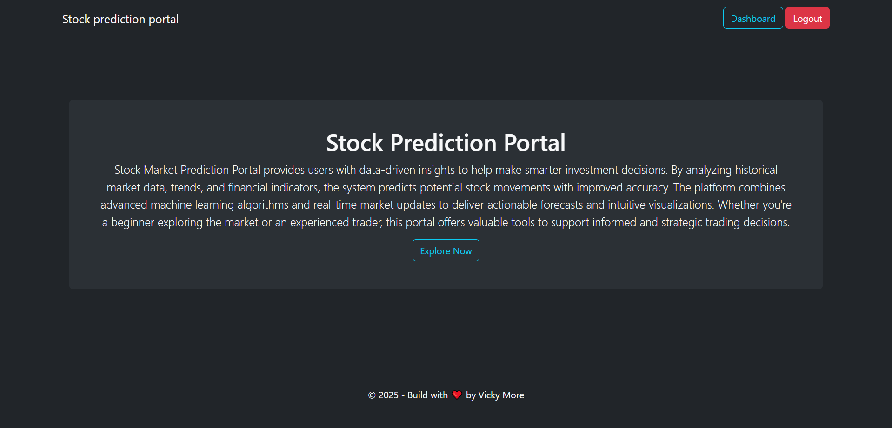
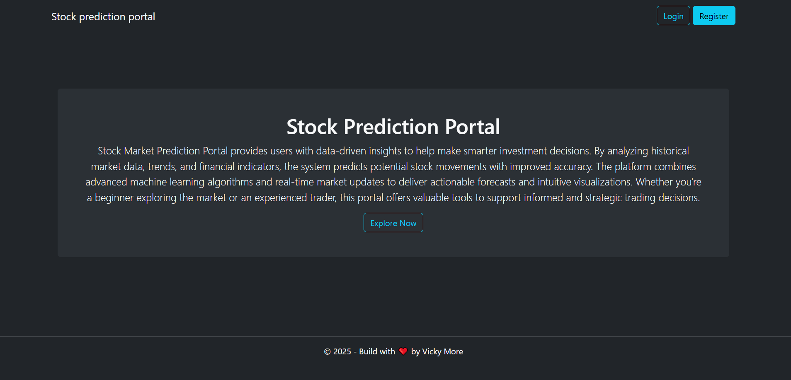
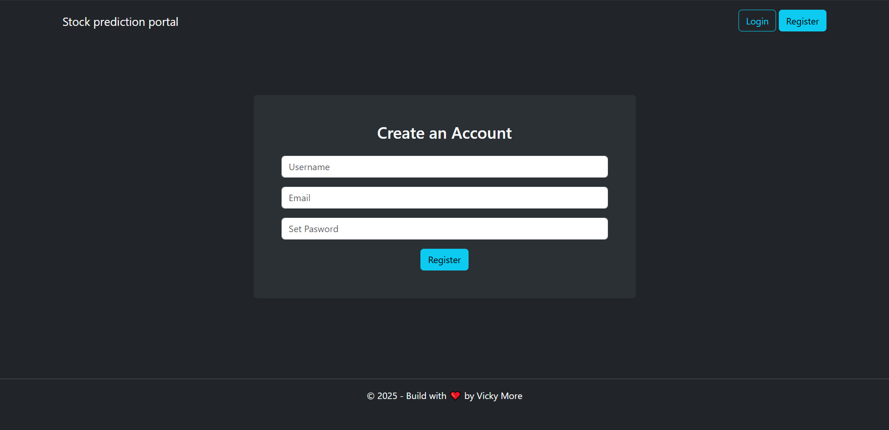
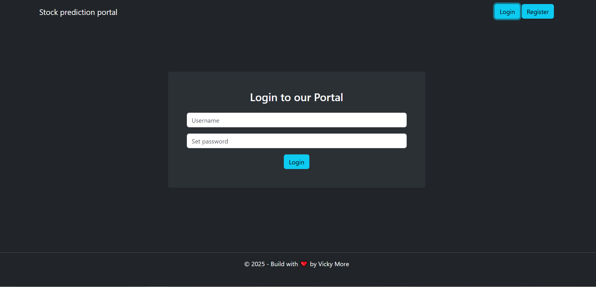

# 📈 Stock Prediction Portal

A full-stack stock prediction web application built using **React** and **Django REST Framework**.  
The system provides **secure JWT-based authentication** and allows authenticated users to **predict stock prices** using a machine-learning model.

This project demonstrates real-world implementation of **REST APIs**, **authentication**, and **frontend–backend integration**.

---

## 🚀 Key Features

- 🔐 JWT Authentication (Access & Refresh Tokens)
- 👤 User Registration & Login
- 📊 Stock Price Prediction using ML
- 🔒 Secure Protected APIs
- 🌐 RESTful Backend with Django
- ⚛️ Modern React Frontend
- 🧩 Scalable & modular architecture

---

## 🏗 Project Architecture


stock-prediction-portal/
├── backend-drf/                     # Django REST API
├── frontend-react/
│   └── stock-prediction-portal/     # React Frontend
├── screenshots/                     # UI Screenshots
├── requirements.txt                # Backend dependencies
└── .gitignore


---

## 🛠 Tech Stack

| Layer | Technology |
|-----|-----------|
| Frontend | React, JavaScript, Axios |
| Backend | Django, Django REST Framework |
| Authentication | JWT (SimpleJWT) |
| Machine Learning | Python (Scikit-Learn / Custom Model) |
| Database | SQLite (Default) |
| API Style | REST |

---

## ⚙️ Installation & Setup

### 1️⃣ Clone Repository

```bash
git clone https://github.com/vivekm98/stock-prediction-portal.git
cd stock-prediction-portal
````

---

### 2️⃣ Backend Setup (Django)

```bash
cd backend-drf
python -m venv venv
source venv/bin/activate     # Windows: venv\Scripts\activate
pip install -r requirements.txt
python manage.py migrate
python manage.py runserver
```

📍 Backend URL:

```
http://127.0.0.1:8000/
```

---

### 3️⃣ Frontend Setup (React)

```bash
cd frontend-react/stock-prediction-portal
npm install
npm start
```

📍 Frontend URL:

```
http://localhost:3000/
```

---

## 🔐 API Endpoints

**Base URL**

```
http://127.0.0.1:8000/api/v1/
```

### 📌 Endpoints Table

| Method | Endpoint           | Description               | Auth Required |
| ------ | ------------------ | ------------------------- | ------------- |
| POST   | `/register/`       | Register a new user       | ❌ No          |
| POST   | `/token/`          | Login & obtain JWT tokens | ❌ No          |
| POST   | `/token/refresh/`  | Refresh access token      | ❌ No          |
| GET    | `/protected-view/` | Protected test endpoint   | ✅ Yes         |
| POST   | `/predict/`        | Predict stock price       | ✅ Yes         |

---

## 🔑 Authentication

Protected endpoints require JWT **Access Token** in headers:

```
Authorization: Bearer <access_token>
```

---

## 📊 Example: Stock Prediction API

**Request**

```http
POST /api/v1/predict/
Authorization: Bearer <access_token>
Content-Type: application/json

{
  "symbol": "AAPL",
  "days": 30
}
```

**Response**

```json
{
  "symbol": "AAPL",
  "predicted_price": 185.75
}
```

---

## 🔐 Authentication Flow

1. User registers via `/register/`
2. Logs in using `/token/`
3. Receives access & refresh tokens
4. Uses access token for protected APIs
5. Refreshes token using `/token/refresh/`

---

## 📷 Screenshots







```

---

## 📦 Dependencies

Backend dependencies are listed in:

```
requirements.txt
```

Frontend dependencies are managed via:

```
package.json
```

---

## 🚀 Future Improvements

* 📉 Historical stock charts
* 📊 Multiple ML model comparison
* ☁️ Cloud deployment (AWS / Render / Vercel)
* 📁 User prediction history
* 🧪 Unit & integration testing

---

## 📜 License

This project is licensed under the **MIT License**.

---

## 👨‍💻 Author

**Vivek More**
🔗 GitHub: [https://github.com/vivekm98](https://github.com/vivekm98)

⭐ If you find this project useful, consider starring the repository!

```

 

