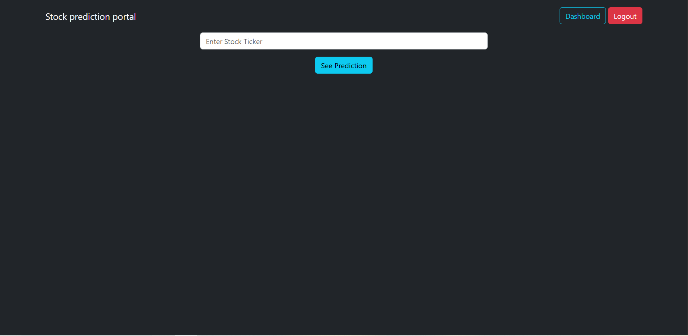
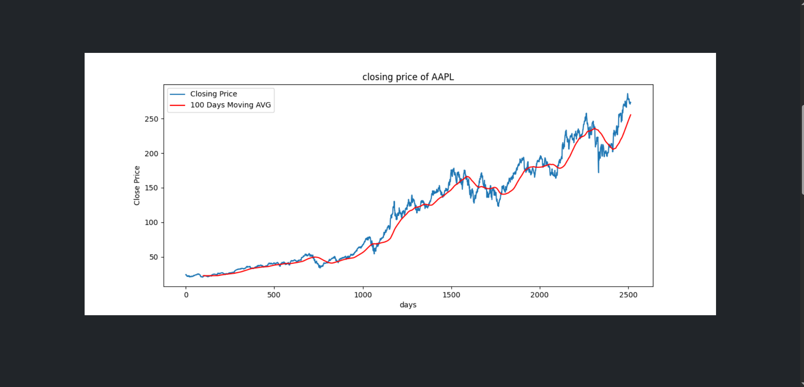
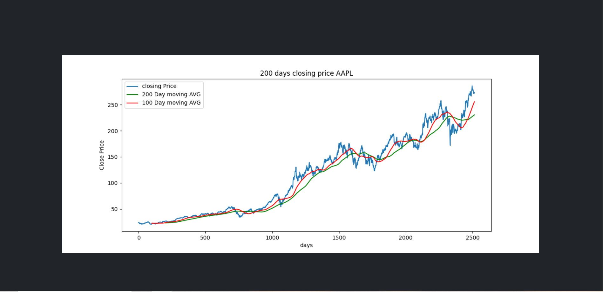
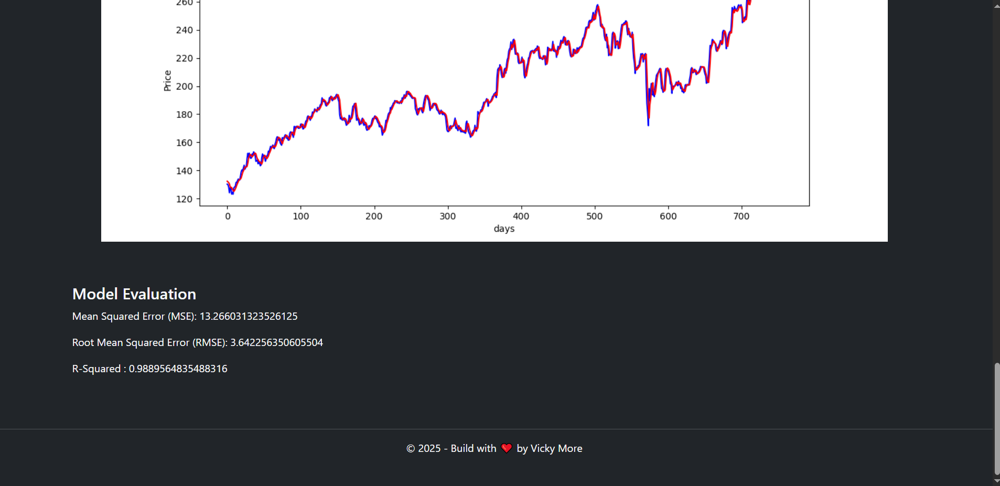

---

# 📈 Stock Prediction Dashboard

**React + Django REST Framework + Machine Learning**

A full-stack stock price prediction dashboard that allows users to enter a stock ticker (e.g. `AAPL`) and view:

* Historical stock price plots
* 100-day & 200-day moving averages
* Final price prediction plot
* Model evaluation metrics (MSE, RMSE, R²)
* JWT-protected API access

---

## 🧰 Tech Stack

### Backend

* Python
* Django
* Django REST Framework
* JWT Authentication
* Machine Learning (NumPy, Pandas, Scikit-learn, Matplotlib)

### Frontend

* React (Vite)
* Axios
* Bootstrap
* Font Awesome

---

## 📂 Project Structure (Simplified)

```
project-root/
│
├── backend/
│   ├── media/                # 🔴 MUST be created manually
│   │   ├── AAPL_plot.png
│   │   ├── AAPL_100_dma.png
│   │   ├── AAPL_200_dma.png
│   │   └── AAPL_final_prediction.png
│   │
│   ├── manage.py
│   ├── settings.py
│   └── urls.py
│
├── frontend/
│   ├── public/
│   ├── src/
│   ├── .env                  # 🔴 MUST be created manually
│   └── vite.config.js
│
└── README.md
```

---

## ⚠️ IMPORTANT SETUP STEPS (DO NOT SKIP)

---

## 🗂️ 1. Create `media` Folder (Backend)

Django **does NOT create this automatically**.

From the `backend/` directory:

```bash
mkdir media
```

All generated plots will be saved here:

```
backend/media/
```

---

## ⚙️ 2. Django Media Configuration

### `settings.py`

```python
MEDIA_URL = '/media/'
MEDIA_ROOT = BASE_DIR / 'media'
```

### `urls.py`

```python
from django.conf import settings
from django.conf.urls.static import static

urlpatterns = [
    # your api routes
]

if settings.DEBUG:
    urlpatterns += static(settings.MEDIA_URL, document_root=settings.MEDIA_ROOT)
```

Restart the Django server after this.

---

## 🌐 3. Create `.env` File (Frontend – Vite)

Inside the **frontend/** directory, create a file named **`.env`**

```env
VITE_BACKEND_BASE_API=http://127.0.0.1:8000/api/v1
VITE_BACKEND_ROOT=http://127.0.0.1:8000
```

⚠️ Notes:

* Variable names **must start with `VITE_`**
* Do **NOT** add a trailing slash
* Restart React after creating or changing `.env`

---

## ▶️ 4. Run the Application

### Backend

```bash
cd backend
python manage.py runserver
```

Backend will run at:

```
http://127.0.0.1:8000
```

---

### Frontend

```bash
cd frontend
npm install
npm run dev
```

Frontend will run at:

```
http://localhost:5173
```

---

## 🔐 Authentication

* JWT authentication is enabled
* Access tokens are stored in `localStorage`
* Protected endpoints require Authorization header

---

## 📊 Prediction API Response (Example)

```json
{
  "status": "success",
  "plot_img": "/media/AAPL_plot.png",
  "plot_100_dma": "/media/AAPL_100_dma.png",
  "plot_200_dma": "/media/AAPL_200_dma.png",
  "pltot_prediction": "/media/AAPL_final_prediction.png",
  "mse": 0.23,
  "rmse": 0.48,
  "r2": 0.91
}
```

## 📊 App Screenshots

### 🎛 Dashboard UI


### 📈 Prediction Output


### 📉 Moving Averages Chart









Frontend automatically builds full image URLs using:

```
VITE_BACKEND_ROOT + image_path
```

---

## 🧪 Troubleshooting

### ❌ Images not loading (`ERR_CONNECTION_REFUSED`)

✔ Backend must be running
✔ `media/` folder must exist
✔ Correct port (`8000`, not `800`)
✔ `.env` file created and React restarted

Test image directly in browser:

```
http://127.0.0.1:8000/media/AAPL_plot.png
```

---

## 🚀 Future Improvements

* Docker support
* Production deployment (Nginx + Gunicorn)
* Real-time stock updates
* Multiple ticker comparison
* User watchlists

---

## 👨‍💻 Author

**Vivek More**

---
